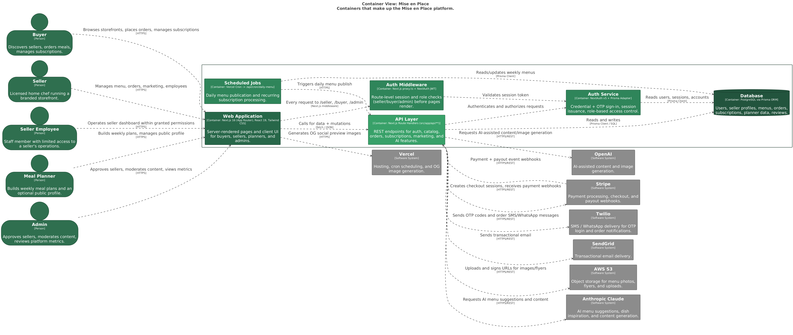

# Mise en Place — Local Community Commerce Platform

A web-based platform connecting independent licensed home chefs, meal planners, and local buyers. Sellers get branded storefronts; planners get a private meal-planning tool with optional public profiles; WhatsApp is the primary engagement channel.

## Quick Setup

```bash
cp .env.example .env          # Fill in your credentials
npx prisma migrate dev        # Apply migrations to your PostgreSQL DB
npx tsx prisma/seed.ts        # Seed test accounts (optional)
npm run dev                   # Start dev server at localhost:3000
```

See `.env.example` for all required environment variables (Stripe, Twilio, SendGrid, AWS S3, PostgreSQL, Anthropic).

## App Structure

- `/s/[slug]` — Public seller storefronts
- `/seller/*` — Seller dashboard (menu, orders, marketing, content)
- `/buyer/*` — Buyer account (orders, subscriptions, favorites)
- `/planner/*` — Meal planner dashboard (weekly menus, grocery list, public profile)
- `/admin/*` — Admin panel (approvals, moderation, metrics)
- `/api/*` — REST API routes

## Architecture

The system is a Next.js 16 (App Router) monolith: server-rendered pages and REST API routes talk to a PostgreSQL database via Prisma, sit behind role-based auth middleware, and integrate with Stripe (payments), Twilio (SMS/WhatsApp), SendGrid (email), AWS S3 (media), and Anthropic/OpenAI (AI features).



The architecture is tracked as code in [`architecture/workspace.dsl`](./architecture/workspace.dsl) (Structurizr DSL / C4 model). Update that file whenever a container or external integration changes, then run `./architecture/generate.sh` to regenerate the diagrams — a GitHub Action does this automatically on `main`. See [`architecture/README.md`](./architecture/README.md) for details.

## Database Migrations

Schema changes are tracked via Prisma Migrate:

```bash
npx prisma migrate dev --name describe_your_change   # Create + apply a migration
npx prisma migrate status                            # Check migration state
npx prisma generate                                  # Regenerate Prisma Client after schema changes
```

Migration history lives in `prisma/migrations/`. **Never use `prisma db push` in production** — it bypasses the migration history.

## Product Spec

See [`PRODUCT.md`](./PRODUCT.md) for the full feature history, data model, API index, and known constraints. Update it when shipping new features.
